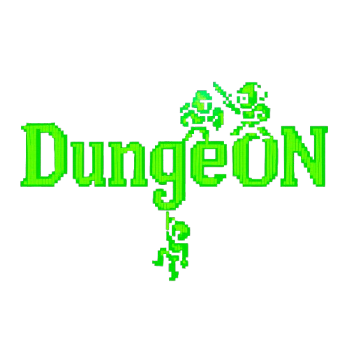

# DungeON



## Descripción

DungeON es un videojuego de rol (RPG) por turnos donde los jugadores deben enfrentar enemigos hasta llegar a un jefe final. Los jugadores pueden elegir entre diferentes clases, cada una con sus características únicas, para enfrentarse a los desafíos que el juego ofrece. Este proyecto está desarrollado en Java (JDK 21) y está diseñado para ejecutarse en la terminal.

# Cómo Clonar el Repositorio

## Método 1: Usando la terminal

1. Abre la terminal (cmd, PowerShell o terminal de VS Code).
2. Ejecuta el siguiente comando:

```sh
   git clone https://github.com/fvnkeez/DungeON.git
```

3. Accede a la carpeta del proyecto:

```sh
   cd DungeON
```
4. Abre el proyecto en Visual Studio Code:

```sh
   code .
```
## Método 2: Usando VSC con interfaz gráfica

1. Abre Visual Studio Code

2. Haz clic en "File" > "Open Folder"

3. En el cuadro de diálogo, navega hasta la ubicación donde quieres clonar el proyecto

4. Haz clic derecho en el área vacía y selecciona "Open in Integrated Terminal"

5. En la terminal que aparece, ejecuta:

```sh
git clone https://github.com/fvnkeez/DungeON.git
```
6. Una vez completada la descarga, haz clic en "File" > "Open Folder" y selecciona la carpeta "DungeON"

---

# Características

- **Clases principales disponibles:**
  - **Guerrero:** Salud alta y daño moderado.
  - **Mago:** Salud baja y daño alto con magia.
  - **Ladrón:** Salud moderada y daño equilibrado.
- **Sistema de combate:**
  - Turnos para atacar y recibir daño.
  - Diferentes habilidades y objetos para elegir.
- **Instrucciones y Créditos:**
  - Menú interactivo para acceder a las instrucciones del juego y visualizar los créditos del equipo de desarrollo.

---

# Instrucciones

1. **Inicio del juego:** Ejecuta el programa para visualizar la pantalla de bienvenida y el menú principal.
2. **Menú principal:**
   - Selecciona una opción:
     - `1`: Jugar.
     - `2`: Ver las instrucciones.
     - `3`: Ver los créditos.
     - `4`: Mostrar historial desde fichero.
     - `5`: Mostrar historial desde base de datos.
     - `6`: Salir del juego.
3. **Selección de clase:**
El jugador puede elegir entre tres clases principales, cada una con sus respectivas subclases:

   - **Guerrero**
   - Bárbaro
   - Caballero

   - **Mago**
   - Hechicero
   - Ocultista

   - **Ladrón**
   - Fantasma
   - Pícaro

   Cada subclase tiene habilidades, estadísticas y estilo de juego únicos.
4. **Combate:**
   - Realiza acciones como atacar al enemigo.
   - Los enemigos contraatacan hasta que uno de los dos quede sin salud.

---

# Cómo Ejecutar el Juego


1. Asegúrate de tener instalado [Java](https://www.java.com/).
2. Compila el proyecto desde la línea de comandos:
   ```sh
   javac -d bin src/*.java
   ```
3. Genera el archivo `.jar` ejecutable:
   ```sh
   jar cfe DungeON.jar DungeON -C bin .
   ```
4. Para ejecutar el juego en Windows, usa el siguiente comando en la terminal (cmd o PowerShell):
   ```sh
   java -jar DungeON.jar
   ```
5. Para ejecutar desde Visual Studio Code:
   ```sh
   Abre el archivo DungeON.java y pulsa Ctrl + F5
   ```

---

# Créditos

**Desarrollo:**
- Daniel Fuente (Desarrollador principal)
- Samuel Díaz (Debugger)

**Diseño de personajes:**
- Jean Pierre Haro
- Daniel Fuente

**Testers:**
- Consuelo Parra
- Guillermo Sierra
- Adrián Sánchez

---


# Estructura del proyecto

La estructura del proyecto en Visual Studio Code es la siguiente:

```
VIDEOJUEGO
├── .vscode
├── bin
├── docs
├── lib
├── src
│   ├── ansi
│   ├── bbdd
│   ├── clases
│   │   ├── guerrero
│   │   ├── ladron
│   │   └──  mago
│   ├── inventario
│   ├── mensajes
│   ├── partida
│   ├── personajes
│   ├── resources
│   ├── utilidades
│   ├── DungeON.java
│   ├── DungeON.sql
├── partidas.txt
├── README.md
└── VIDEOJUEGO.jar


```

---

# Notas Adicionales

- **Estado del proyecto:**
  - Funcionalidades principales terminadas.
- **Colaboraciones:** Si tienes sugerencias o deseas contribuir al proyecto, no dudes en contactarnos.
